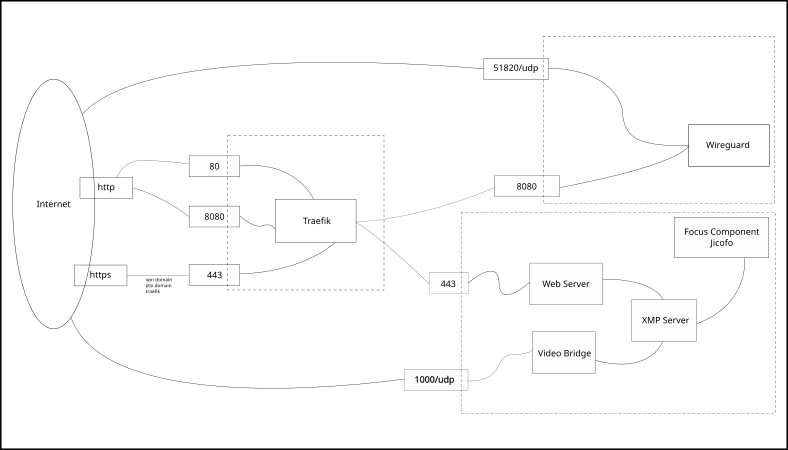

# Docker setup
This system is a bundle created to provide services related to jitsi video metting
## System features
- Jitsi videocall service
- Wireguard vpn web ui
- Wireguard vpn
- Traefik as a reverse proxy
- Traefik dashboard
- Calendar service to schedule videocalls
## System requirements
- Unix system
- Docker and docker-compose installed
- 4 domains to:
    - Vpn web ui
    - Traefik dashboard
    - Jitsi meet
    - Calendar
- Server with open ports on firewall (at least 80,443 and 51820)
- Andministrator email
## System diagram

